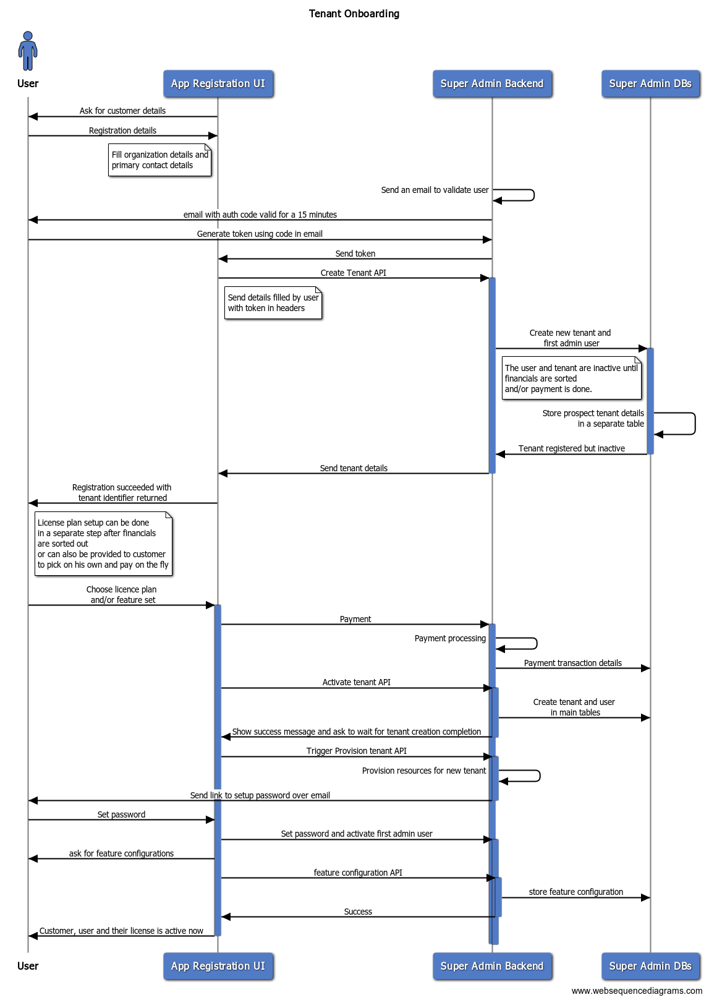
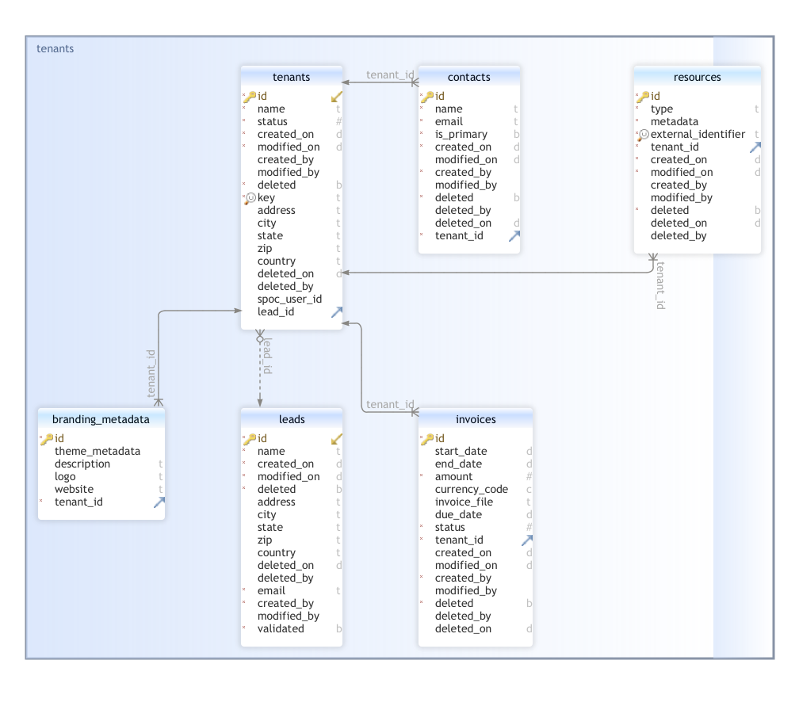

@sourceloop/ctrl-plane-tenant-management-service / [Exports](modules.md)

# tenant-management-service

[-@2x.png>)](http://loopback.io/)

This is the primary service of the control plane responsible for onboarding a tenant and triggering it's provisioning.

## Overview

A Microservice for handling tenant management operations. It provides -

- lead creation and verification
- Tenant Onboarding of both pooled and silo tenants
- Billing and Invoicing
- Provisioning of resources for silo and pooled tenants

### work flow


## Installation

Install Tenant Management Service using `npm`;

```sh
$ [npm install | yarn add] @sourceloop/tenant-management-service
```

## Usage

- Create a new Loopback4 Application (If you don't have one already)
  `lb4 testapp`
- Install the tenant management service
  `npm i @sourceloop/tenant-management-service`
- Set the [environment variables](#environment-variables).
- Run the [migrations](#migrations).
- Add the `TenantManagementServiceComponent` to your Loopback4 Application (in `application.ts`).
  ```typescript
  // import the TenantManagementServiceComponent
  import {TenantManagementServiceComponent} from '@sourceloop/tenant-management-service';
  // add Component for TenantManagementService
  this.component(TenantManagementServiceComponent);
  ```
- Set up a [Loopback4 Datasource](https://loopback.io/doc/en/lb4/DataSource.html) with `dataSourceName` property set to
  `TenantManagementDB`. You can see an example datasource [here](#setting-up-a-datasource).
- Bind any of the custom [providers](#providers) you need.

## Onboarding a tenant

- The onboarding process starts through a concept of a `Lead`. A `Lead` is a prospective client who may or may not end being a tenant in our system.
- The overall flow could be something like this -
  
- The `Lead` is created through POST `/leads` endpoint, which creates a Lead and sends an email to verify the email address of the lead
- The mail has a link which should direct to a front end application, which in turn would call the upcoming api's using a temporary authorization code included in the mail.
- The front end application first calls the `/leads/{id}/verify` which updates the validated status of the lead in the DB and returns a new JWT Token that can be used for subsequent calls
- If the token is validated in the previous step, the UI should call the `/leads/{id}/tenants` endpoint with the necessary payload(as per swagger documentation).
- This endpoint would onboard the tenant in the DB, and the facade is then supposed to trigger the relevant events using the `/tenants/{id}/provision` endpoint.
- The provisioning endpoint will invoke the publish method on the `EventConnector`. This connector's purpose is to provide a place for consumer to write the event publishing logic. And your custom service can be bound to the key `EventConnectorBinding` exported by the service. Refer the example with Amazon EventBridge implementation in the [sandbox](./sandbox).

## Webhook Integration

- A webhook endpoint is available in the service that is supposed to update the status of a tenant based on the updates from the third-party responsible for actual provisioning of resources
- To add Webhook configuration in your application, add the `WebhookTenantManagementServiceComponent` to your Loopback4 Application (in `application.ts`).
  ```typescript
  // import the UserTenantServiceComponent
  import {WebhookTenantManagementServiceComponent} from '@sourceloop/tenant-management-service';
  // add the component here
  this.component(WebhookTenantManagementServiceComponent);
  ```
- To test this from local, ensure that your local service is exposed through a tool like [ngrok](https://ngrok.com/) or [localtunne](https://github.com/localtunnel/localtunnel)
- Your third-party tool is responsible for hitting this endpoint with the expected payload and a signature and timestamp in headers `x-signature` and `x-timestamp` respectively.
- The signature is derived using the following logic (written in Node.js but could be implemented in any other language) -

```js
const timestamp = Date.now();
const secret = process.env.SECRET;
const context = process.env.CONTEXT_ID;
const payload = `{"status":"success", "initiatorId":${process.env.TENANT_ID},"type":0}`;
const signature = crypto
  .createHmac('sha256', secret)
  .update(`${payload}${context}${timestamp}`)
  .digest('hex');
```

### Environment Variables

<table>
  <thead>
    <th>Name</th>
    <th>Required</th>
    <th>Description</th>
    <th>Default Value</th>
  </thead>
  <tbody>
      <tr>
        <td>NODE_ENV</td>
        <td>Y</td>
        <td>Node environment value, i.e. `dev`, `test`, `prod</td>
        <td></td>
      </tr>
      <tr>
        <td>LOG_LEVEL</td>
        <td>Y</td>
        <td>Log level value, i.e. `error`, `warn`, `info`, `verbose`, `debug`</td>
        <td></td>
      </tr>
      <tr>
        <td>DB_HOST</td>
        <td>Y</td>
        <td>Hostname for the database server.</td>
        <td></td>
      </tr>
      <tr>
        <td>DB_PORT</td>
        <td>Y</td>
        <td>Port for the database server.</td>
        <td></td>
      </tr>
      <tr>
        <td>DB_USER</td>
        <td>Y</td>
        <td>User for the database.</td>
        <td></td>
      </tr>
      <tr>
        <td>DB_PASSWORD</td>
        <td>Y</td>
        <td>Password for the database user.</td>
        <td></td>
      </tr>
      <tr>
        <td>DB_DATABASE</td>
        <td>Y</td>
        <td>Database to connect to on the database server.</td>
        <td></td>
      </tr>
      <tr>
        <td>DB_SCHEMA</td>
        <td>Y</td>
        <td>Database schema used for the data source. In PostgreSQL, this will be `public` unless a schema is made explicitly for the service.</td>
        <td></td>
      </tr>
      <tr>
        <td>REDIS_HOST</td>
        <td>Y</td>
        <td>Hostname of the Redis server.</td>
        <td></td>
      </tr>
      <tr>
        <td>REDIS_PORT</td>
        <td>Y</td>
        <td>Port to connect to the Redis server over.</td>
        <td></td>
      </tr>
      <tr>
        <td>REDIS_URL</td>
        <td>Y</td>
      <td>Fully composed URL for Redis connection. Used instead of other settings if set.</td>
        <td></td>
      </tr>
      <tr>
        <td>REDIS_PASSWORD</td>
        <td>Y</td>
        <td>Password for Redis if authentication is enabled.</td>
        <td></td>
      </tr>
      <tr>
        <td>REDIS_DATABASE</td>
        <td>Y</td>
        <td>Database within Redis to connect to.</td>
        <td></td>
      </tr>
      <tr>
        <td>JWT_SECRET</td>
        <td>Y</td>
        <td>Symmetric signing key of the JWT token.</td>
        <td></td>
      </tr>
      <tr>
        <td>JWT_ISSUER</td>
        <td>Y</td>
        <td>Issuer of the JWT token.</td>
        <td></td>
      </tr>
      <tr>
        <td>SYSTEM_USER_ID</td>
        <td>Y</td>
        <td>system user id.</td>
        <td></td>
      </tr>
      <tr>
        <td>FROM_EMAIL</td>
        <td>Y</td>
        <td>email to send notification.</td>
        <td></td>
      </tr>
      <tr>
        <td>APP_NAME</td>
        <td>Y</td>
        <td>app name.</td>
        <td></td>
      </tr>
      <tr>
        <td>APP_VALIDATE_URL</td>
        <td>Y</td>
        <td>frontend url to validate.</td>
        <td></td>
      </tr>
      <tr>
        <td>APP_LOGIN_URL</td>
        <td>Y</td>
        <td>control plane url.</td>
        <td></td>
      </tr>
      <tr>
        <td>VALIDATION_TOKEN_EXPIRY</td>
        <td>Y</td>
        <td>expiry time for token.</td>
        <td></td>
      </tr>
      <tr>
        <td>AWS_REGION</td>
        <td>Y</td>
        <td>aws region.</td>
        <td></td>
      </tr>
      <tr>
        <td>PUBLIC_API_MAX_ATTEMPTS</td>
        <td>Y</td>
        <td>number of attempts for public api.</td>
        <td></td>
      </tr>
      <tr>
        <td>WEBHOOK_API_MAX_ATTEMPTS</td>
        <td>Y</td>
        <td>number of attempts for webhook api.</td>
        <td></td>
      </tr>
      <tr>
        <td>WEBHOOK_SECRET_EXPIRY</td>
        <td>Y</td>
        <td>expiry time for webhook secret.</td>
        <td></td>
      </tr>
      <tr>
        <td>LEAD_TOKEN_EXPIRY</td>
        <td>Y</td>
        <td>expiry time for lead token.</td>
        <td></td>
      </tr>
      <tr>
        <td>SILOED_PIPELINE</td>
        <td>Y</td>
        <td>pipeline key for soloed.</td>
        <td></td>
      </tr>
      <tr>
        <td>POOLED_PIPELINE</td>
        <td>Y</td>
        <td>pipeline key for pooled.</td>
        <td></td>
      </tr>
      <tr>
        <td>LEAD_KEY_LENGTH</td>
        <td>Y</td>
        <td>lenght of random key for lead.</td>
        <td></td>
      </tr>

  </tbody>
</table>

### Setting up a `DataSource`

Here is a sample Implementation `DataSource` implementation using environment variables and PostgreSQL as the data source.

```typescript
import {inject, lifeCycleObserver, LifeCycleObserver} from '@loopback/core';
import {juggler} from '@loopback/repository';
import {TenantManagementDbSourceName} from '@sourceloop/tenant-management-service';

const config = {
  name: TenantManagementDbSourceName,
  connector: 'postgresql',
  url: '',
  host: process.env.DB_HOST,
  port: process.env.DB_PORT,
  user: process.env.DB_USER,
  password: process.env.DB_PASSWORD,
  database: process.env.DB_DATABASE,
  schema: process.env.DB_SCHEMA,
};

@lifeCycleObserver('datasource')
export class AuthenticationDbDataSource
  extends juggler.DataSource
  implements LifeCycleObserver
{
  static dataSourceName = TenantManagementDbSourceName;
  static readonly defaultConfig = config;

  constructor(
    // You need to set datasource configuration name as 'datasources.config.Authentication' otherwise you might get Errors
    @inject(`datasources.config.${TenantManagementDbSourceName}`, {
      optional: true,
    })
    dsConfig: object = config,
  ) {
    super(dsConfig);
  }
}
```

create one more datasource with redis as connector and db name 'TenantManagementCacheDB' that is used for cache

```typescript
import {inject, lifeCycleObserver, LifeCycleObserver} from '@loopback/core';
import {AnyObject, juggler} from '@loopback/repository';
import {readFileSync} from 'fs';

const config = {
  name: 'TenantManagementCacheDB',
  connector: 'kv-redis',
  host: process.env.REDIS_HOST,
  port: process.env.REDIS_PORT,
  password: process.env.REDIS_PASSWORD,
  db: process.env.REDIS_DATABASE,
  url: process.env.REDIS_URL,
  tls:
    +process.env.REDIS_TLS_ENABLED! ||
    (process.env.REDIS_TLS_CERT
      ? {
          ca: readFileSync(process.env.REDIS_TLS_CERT),
        }
      : undefined),
  sentinels:
    +process.env.REDIS_HAS_SENTINELS! && process.env.REDIS_SENTINELS
      ? JSON.parse(process.env.REDIS_SENTINELS)
      : undefined,
  sentinelPassword:
    +process.env.REDIS_HAS_SENTINELS! && process.env.REDIS_SENTINEL_PASSWORD
      ? process.env.REDIS_SENTINEL_PASSWORD
      : undefined,
  role:
    +process.env.REDIS_HAS_SENTINELS! && process.env.REDIS_SENTINEL_ROLE
      ? process.env.REDIS_SENTINEL_ROLE
      : undefined,
};

// Observe application's life cycle to disconnect the datasource when
// application is stopped. This allows the application to be shut down
// gracefully. The `stop()` method is inherited from `juggler.DataSource`.
// Learn more at https://loopback.io/doc/en/lb4/Life-cycle.html
@lifeCycleObserver('datasource')
export class RedisDataSource
  extends juggler.DataSource
  implements LifeCycleObserver
{
  static readonly dataSourceName = 'TenantManagementCacheDB';
  static readonly defaultConfig = config;

  constructor(
    @inject(`datasources.config.TenantManagementCacheDB`, {optional: true})
    dsConfig: AnyObject = config,
  ) {
    if (
      +process.env.REDIS_HAS_SENTINELS! &&
      !!process.env.REDIS_SENTINEL_HOST &&
      !!process.env.REDIS_SENTINEL_PORT
    ) {
      dsConfig.sentinels = [
        {
          host: process.env.REDIS_SENTINEL_HOST,
          port: +process.env.REDIS_SENTINEL_PORT,
        },
      ];
    }
    super(dsConfig);
  }
}
```

### Migrations

The migrations required for this service can be copied from the service. You can customize or cherry-pick the migrations in the copied files according to your specific requirements and then apply them to the DB.

## Database Schema



The major tables in the schema are briefly described below -

**Address** - this model represents the address of a company or lead

**Contact** - this model represents contacts belonging to a tenant

**Invoice** - this model represents an invoice with the amount and period generated for a tenant in the system

**Leads** - this model represents a lead that could eventually be a tenant in the system

**Tenants** - main model of the service that represents a tenant in the system, either pooled or siloed
